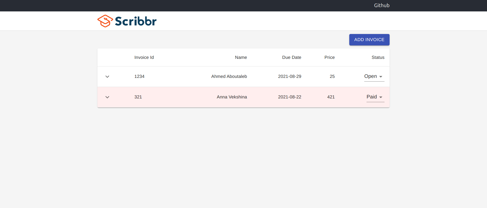

# Invoice Frontend

### Getting Started

In order to run the project, you should 
- Clone both invoice frontend and invoice backend
- Open two terminals and browse into each of the repos
- Run export SENDGRID_API_KEY=[API_KEY that is provided to you] in the backend terminal
- Run `npm i` and `npm start` in both terminals. 
- The app will be accessible via [http://localhost:3000](http://localhost:3000).

### Features
The invoice app includes functionalities like:
- Showing the list of invoices
- Showing more details for each invoice
- Adding new invoices
- Saving the invoices in a txt file
- Highlighting the overdued invoices
- Sending the invoice via email (temporarily stopped working: Sendgrid account is under review)

### Further Steps
- Using a database for storing the invoice list
- Adding useContext Hook
- Having better validation and error checkings
- Adding search/filter for the invoices
- Hosting the app
